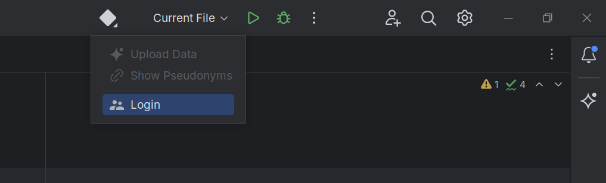

# cbpg-demo
Reference implementation of Credential-Based Pseudonym Generation, a pseudonymization technique for collecting programming process data in a privacy-preserving way.

> [!NOTE]
> This repository contains supplementary material of the following paper:  
>
> Björn Fischer, Marc Stöttinger, Berit Barthelmes, Sven Eric Panitz, and Ralf
Dörner. 2025. Credential-Based Pseudonym Generation for Programming
Process Data Collection. In Proceedings of the 30th ACM Conference on
Innovation and Technology in Computer Science Education V. 1 (ITiCSE 2025),
June 27-July 2, 2025, Nijmegen, Netherlands. ACM, New York, NY, USA,
7 pages. https://doi.org/10.1145/3724363.3729046

The repository consists of the following components:

* Sample configuration for **Keycloak** and **OpenLDAP**, serving as the authentication backend(s) for pseudonym generation. The configuration also includes a **Keycloak extension** that invalidates the access and refresh tokens of users who change their passwords.
* An **IntelliJ** plugin, serving as the data collection frontend with support for offline data collection.
* An application built with the **Spring Framework**, serving as the data collection backend that uses **MongoDB** for data persistence.

## Setup

1. Install Docker
2. Copy the example configuration: `cp .env.example .env`
3. Run `./setup.sh`

You can then choose between two compose configurations. In the standalone configuration, users are managed in Keycloak. In the OpenLDAP configuration, users are managed in OpenLDAP and synchronized with Keycloak.

* Standalone: Run `docker compose up`.
* OpenLDAP: Run `docker compose -f docker-compose.yml -f docker-compose.openldap.yml up`.

Unfortunately, Microsoft's Active Directory (MSAD) cannot be easily mocked with Docker. We have provided a simplified version of the [Keycloak configuration](auth/keycloak-conf/variants/msad) that is used at [RheinMain University of Applied Sciences](https://www.hs-rm.de/en/). This may require some tweaking, as the directory layout will probably not match the layout of your university.

## Plugin Usage
To install the plugin, navigate to `File` -> `Settings` -> `Plugins` -> `⚙` -> `Manage Plugin Repositories`. Add the url of the plugin repository ([`https://localhost:8443/`](https://localhost:8443)), click `OK`, and search for the plugin (`CBPG Demo Plugin`). After installing, you should see the plugin menu in the top right corner:



There you can log in with the demo user (username: turing, password: turing). Note that the plugin may require some seconds to generate the pseudonym on the first login. You can view your pseudonyms through the corresponding item in the menu. 

The plugin simulates data collection by snapshotting any `*.java` file that you save. It will attempt to regularly upload the collected data to the backend. You can trigger the upload manually by clicking the corresponding menu item or by logging in again. For viewing the data you may use [Mongo Express](http://localhost:8083/).

## User Management and Password Changes
When using OpenLDAP, you can use [phpLDAPadmin](http://localhost:8082) to change or add users at runtime. For the standalone configuration, open the [Keycloak admin console](http://localhost:8080/admin/) and navigate to the `Users` page in the `Demo` realm. Users can also use the self-registration by navigating to the [Keycloak account console](http://localhost:8080/realms/Demo/account/) -> `Sign in` -> `Register`.

Depending on the configuration you use, passwords can be changed through [phpLDAPadmin](http://localhost:8082) or by logging into the [Keycloak account console](http://localhost:8080/realms/Demo/account/). Note that the plugin checks password changes right before the next upload. If you use the OpenLDAP configuration, it may take up to 15 minutes to detect password changes because Keycloak synchronizes with OpenLDAP every 15 minutes.

## Configuration
| Service | URL |
| ------- | ---- |
| Plugin Repository | https://localhost:8443/ |
| Backend | http://localhost:8081/ |
| phpLDAPadmin | http://localhost:8082/ |
| Keycloak | http://localhost:8080/ |
| Mongo Express | http://localhost:8083/ |

See the [`.env`](.env)/[`.env.example`](.env.example) files for login credentials and other configuration options, such as the timezone. Note that you need to use the value of the `LDAP_ADMIN_DN` variable as the username for logging into phpLDAPadmin.

You can change the configuration, so that users are automatically created during inititalization. If you use the OpenLDAP configuration, you have to update [`auth/seed.ldif`](auth/seed.ldif). In this case, you also need to update [`auth/keycloak-conf/variants/openldap/users.json`](auth/keycloak-conf/variants/openldap/users.json) to match the OpenLDAP configuration. If you use the standalone configuration, you only need to update [`auth/keycloak-conf/variants/standalone/users.json`](auth/keycloak-conf/variants/standalone/users.json). 

After changing the Keycloak configuration files, rebuild the image with `docker compose build keycloak-conf`. Then, run `./reset.sh` and restart the containers. Note that running `./reset.sh` is also required if you change [`auth/seed.ldif`](auth/seed.ldif) or if you want to reset the databases used in the containers.

## SSL Configuration for the Plugin Repository
The plugin repository uses a self-signed certificate which needs to be accepted in IntelliJ while installing the plugin. Please note that IntelliJ does not allow to install plugins over HTTP, so this is required.

If you want to use your own keys, you may need to first generate them. Please refer to the [Dockerfile](plugin/Dockerfile) for an example, but consider that this may not be production-ready. After removing the generation logic in the Dockerfile, map the local `*.key` and `*.crt` files on your host to the container and you are done:

```yml title=docker-compose.yml
plugin:
  volumes:
    - 'path/to/key/file:/usr/local/apache2/conf/server.key' 
    - 'path/to/crt/file:/usr/local/apache2/conf/server.crt' 
```